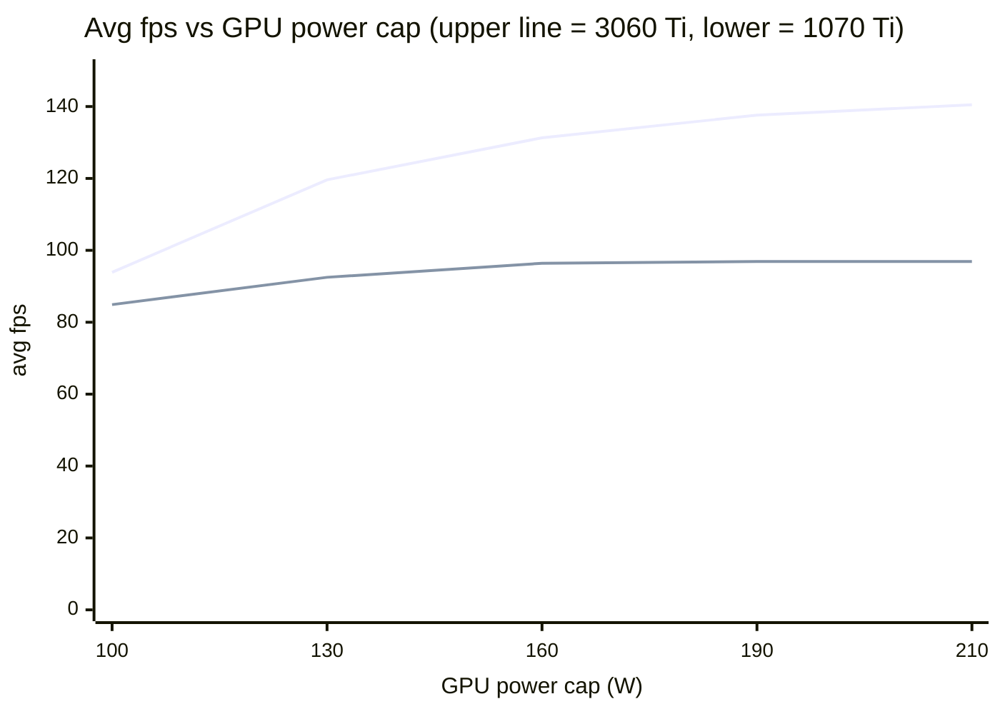
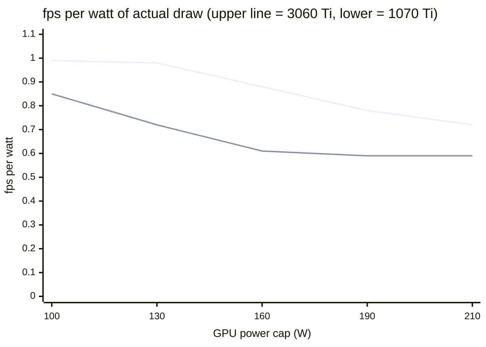

# 96 — GPU fps-per-watt characterization and the four power modes

**Status: both cards swept 2026-09-03; instrument locked; four-mode framework defined from
the numbers. VR per-game validation is BLOCKED on the headset display (see §8) and is the
open follow-up. Companion to `docs/90` (two-card decode comparison), `docs/69` (flat
benchmark tooling), `docs/84` (per-game VR tuning method), `docs/48`/`docs/68` (power).**

The question this answers: for each card, how does framerate scale with the GPU power cap,
where is the efficiency knee, and — since the booth runs on the **dev rig** — which power
mode should each title use. A prior pass mixed methods (one card by GUI, the other engine-
direct) at mismatched wattages and was worthless for comparison; this redoes it cleanly.

## 1. Instrument

**Unigine Superposition, 1080p Medium preset (preset 2), OpenGL** — the same preset on both
cards, so the comparison is apples-to-apples. This is a **flat (non-VR) card-characterization
proxy**, not a VR workload: it fixes the card's efficiency *shape*. Real VR titles render
per-eye at ~2160² at 90 Hz and are a different, heavier load — their absolute fps at each
mode must be measured in-headset (§8), not read off this curve.

How each pass is driven and harvested (fully scriptable, display-independent):

- The launcher's exact engine command line, captured from `ps` while the GUI ran a pass:
  ```
  bin/superposition -preset 2 -video_app opengl -video_vsync 0 -video_mode -1 \
    -console_command "world_load superposition/superposition && render_manager_create_textures 1" \
    -video_fullscreen 1 -video_width 1920 -video_height 1080 \
    -virtual_width 1920 -virtual_height 1080 -extern_plugin GPUMonitor -mode 0 -sound 1
  ```
  (`-mode 0` alone does **not** start the scored run — the `world_load … && render_manager_create_textures`
  console command is what kicks it off. An empty config leaves the engine idle at 1600×900.)
- **Score** read from the launcher's result screen (dev rig, display works) or from the
  `.score` filename the launcher writes into `results_dir` (everyday box — its display shows
  black under the 550 driver, a present bug; the benchmark still computes and scores fine, so
  the on-disk score is the honest instrument there).
- **Actual power draw** sampled with `nvidia-smi` every 3 s across each pass; the tables below
  report the average over the busy window, not the cap setpoint.
- Superposition's score is exactly `avg_fps × 133.7` (constant verified across all five dev-rig
  points), so score and avg fps are interchangeable.

Caps were set on the dev rig with `scripts/vr-power-setup.sh --gpu-limit <pct>` (watchdog
stopped for the sweep, restored after) and on the everyday box with `nvidia-smi -pl <W>`.

## 2. Results — RTX 3060 Ti (dev rig, driver 595, cap range 100–210 W)

| cap (W) | actual draw (W) | score | avg fps | fps/W (draw) | marginal Δfps/W |
|--------:|----------------:|------:|--------:|-------------:|----------------:|
| 100 | 94.9 | 12549 | 93.86 | 0.99 | — |
| 130 | 122.3 | 15995 | 119.64 | 0.98 | 0.94 |
| 160 | 148.8 | 17553 | 131.29 | 0.88 | 0.44 |
| 190 | 176.4 | 18400 | 137.63 | 0.78 | 0.23 |
| 210 | 195.4 | 18785 | 140.51 | 0.72 | 0.15 |

**85 % of turbo fps at 63 % of turbo power (130 W). From 130 → 210 W (+61 % watts) you buy
only +21 fps (+17 %).** The marginal return collapses after ~130–160 W: each extra watt past
160 W is worth well under half an fps.

## 3. Results — GTX 1070 Ti (everyday box, driver 550, cap range 90–252 W)

| cap (W) | actual draw (W) | score | avg fps | fps/W (draw) |
|--------:|----------------:|------:|--------:|-------------:|
| 100 | ~100 | 11351 | 84.9 | 0.85 |
| 130 | 128.7 | 12366 | 92.5 | 0.72 |
| 160 | 157.9 | 12895 | 96.4 | 0.61 |
| 252 (cap) | **163.9** | 12951 | 96.9 | 0.59 |

**The 1070 Ti is clock/voltage-limited, not power-limited: at a 252 W cap it still draws only
~164 W** — it physically cannot use more. Its real ceiling is ~97 fps at ~164 W; any cap
above ~160 W is dead headroom. Its efficiency peak is at the floor (~90–100 W); adding power
is almost pure waste.

## 4. Head-to-head at matched power

Both series on the cap axis (the 1070 Ti is drawn flat past 160 W because it self-caps there):





| power | 1070 Ti | 3060 Ti | 3060 Ti advantage |
|------:|:--------|:--------|:------------------|
| 100 W | 84.9 fps · 0.85 fps/W | 93.9 fps · 0.99 fps/W | +10 % fps · +16 % efficiency |
| 130 W | 92.5 fps · 0.72 fps/W | 119.6 fps · 0.98 fps/W | +29 % fps · +36 % efficiency |
| 160 W | 96.4 fps · 0.61 fps/W | 131.3 fps · 0.88 fps/W | +36 % fps · +44 % efficiency |
| ~195 W | *unreachable (ceiling ~97 fps @ ~164 W)* | 140.5 fps | — |

**The 3060 Ti wins on both fps and fps/W at every matched wattage, and the gap widens with
power** because it turns extra watts into frames while the 1070 Ti cannot.

## 5. Background-load impact (dev rig 3060 Ti @ 210 W; everyday box 1070 Ti @ 160 W)

Measured by re-running the benchmark with a background GPU/CPU consumer live and comparing to
the idle score at the same cap.

| card @ cap | condition | avg fps | Δ vs idle | what the load actually was |
|:-----------|:----------|--------:|----------:|:---------------------------|
| 3060 Ti @ 210 W | idle | 140.5 | — | — |
| 3060 Ti @ 210 W | + Sunshine streaming | 136.6 | **−2.8 %** | NVENC 9.8 % sustained (dedicated silicon) |
| 3060 Ti @ 210 W | + Sunshine + YouTube 4K | 131.2 | **−6.6 %** | chrome 105 % CPU, GPU `dec` = **0 %** (soft-decode) |
| 1070 Ti @ 160 W | idle | 96.4 | — | — |
| 1070 Ti @ 160 W | + YouTube 4K | 82.1 | **−14.8 %** | GPU `dec` 9 % (hwdec) + chrome 245 % CPU + compositing |

Two findings that matter for the booth:

1. **A CPU-soft-decoded browser video (YouTube 4K) hurts *more* than a GPU-hardware-encoded
   stream (Sunshine)** — ~−3.9 % marginal vs −2.8 %. NVENC is dedicated silicon and barely
   touches the 3D SMs; chrome's software decode steals the CPU core the game needs for driver
   submission. Counter-intuitive but consistent.
2. **The weaker card suffers background load far worse.** The same 4K video costs the 3060 Ti
   ~−4 % but the 1070 Ti **−15 %** — on the 1070 Ti the video hardware-decodes on a weak NVDEC
   *and* burns >2 CPU cores *and* competes for compute on a card already at its ceiling. Rule:
   background activity on the 1070 Ti box is expensive; on the 3060 Ti it is nearly free.

   Driver note: the 595 open driver (dev rig) did **not** GPU-decode YouTube (`dec` 0, CPU
   only); the 550 driver (everyday box) **did** (`dec` 9 %). Different contention profiles.

### 5.1 Aside — Quake II RTX, a GPU-bound counter-example (dev rig 3060 Ti, 2026-09-03)

Everything above this line is Superposition, chosen so both cards compare apples-to-apples
(§1) — it says nothing about whether a title can actually *be* GPU-bound.
`scripts/q2rtx-power-sweep.sh` exists to hold up the opposite case (`docs/48`): Quake II RTX's own
`timedemo 1` (`q2demo1`, 631 frames, full RTX path tracer, Steam appid `1089130`) pins the GPU
at ~95 %+ utilization for the whole run — no CPU/pacing ceiling in the way, unlike every VR
title in this doc. Re-swept 2026-09-03 on the post-swap 3060 Ti (210 W max), superseding the
prior card's numbers in `docs/48`:

| cap | mean fps | note |
|----:|---------:|:-----|
| 210 W | 74.6 | turbo |
| 190 W | 74.5 | knee — within 1 % of max |
| 160 W | 71.3 | one low rep, 67.3 among 73.0/73.7/67.3 — likely a background blip, not the card |
| 130 W | 62.3 | |
| ~100 W | 47.3 | 100 W floor; the harness's own 47 % → 98.7 W was refused by the card, re-run at 48 % / 100.8 W |

**The exact opposite shape of every VR title above.** 210→190 W costs almost nothing (~0.1 %);
below that the decline steepens fast — roughly −4 %, −13 %, then −24 % per further 30 W step
down. Where a VR title is hard-locked to 90 Hz and gets nothing for watts past its knee, Q2RTX's
path tracer converts nearly every watt below ~190 W straight into frames. This is the GPU-bound
counter-example `scripts/q2rtx-power-sweep.sh` was built to hold up against the "capping is
free" claim (`docs/48`) — the two shapes only make sense side by side.

**TODO, flagged not chased**: pre-RTX-2000 cards (1070 Ti — Pascal, 1660 — Turing) have no RT
cores and can't run Q2RTX's RTX path at a meaningful frame rate, so this instrument can't extend
§4's two-card comparison to those cards. A raster benchmark — vkQuake or yquake2's classic
(non-RTX) renderer — is the one that would; not built yet.

## 6. The four power modes — defined from the numbers

<!-- FILL: per-game recommendation table (agent 1) + mode->watt mapping refined (agent 2) -->

| mode | intent | 3060 Ti | 1070 Ti |
|:-----|:-------|:--------|:--------|
| **full-eco** | maximum saving | 100 W → 94 fps | ~90–100 W → 85 fps |
| **smart-eco** | best fps per watt | 130 W → 120 fps | ~100 W → 85 fps (peak is at the floor) |
| **max-reasonable** | most fps before saturation | 160 W → 131 fps | 130 W → 92 fps |
| **turbo** | ceiling | 210 W → 140 fps | ~160 W → 97 fps (self-capped) |

## 7. Wiring the modes into the rig

The control mechanism already exists; it just has no named tiers. Today it is strictly binary
(`scripts/vr-power-watchdog.py`): **performance** (`vr-power-setup.sh --apply` + `GPU_LIMIT_PCT`%
of the card's max watts) whenever `monado-service` **or** a Proton game is running, else
**saver** (GPU floored to `power.min_limit`) after ~30 s idle. The cap is always **a percent of
the live card's `power.max_limit`** (`set_gpu_limit_pct()` → `nvidia-smi -pl $((max*pct/100))`),
so a given percent is a different wattage on each card — after the swap `GPU_LIMIT_PCT=100` means
210 W on the dev rig (was 250 W). **Never persist absolute watts; always recompute from the live
card's max/min** (`docs/92`).

Map the four modes onto `GPU_LIMIT_PCT`. The percentages agree between this Superposition sweep
(3060 Ti knee at 130 W = **62 % of 210 W**) and the earlier GPU-bound sweep in
`docs/48` (knee ~60 % of max, Quake II RTX 175→100 W = −24.2 %):

| mode | GPU_LIMIT_PCT | on the 3060 Ti | note |
|:-----|:-------------:|:---------------|:-----|
| **full-eco** | min_limit (≈48 %) | 100 W → 94 fps | == today's `--saver` floor, just named. Saves ~0 W at idle (`docs/48`); it is a deliberate ceiling for heat/noise, not an idle saver. |
| **smart-eco** | ~60 % | 130 W → 120 fps | the measured knee — the one genuinely new tier. Free for pacing-bound VR, real savings for GPU-bound titles. |
| **max-reasonable** | ~75 % | ~160 W → 131 fps | the rig's own prior validated default (was `GPU_LIMIT_PCT=70`). |
| **turbo** | 100 % | 210 W → 140 fps | today's live default; required by titles that touch the ceiling at 90 fps (Dalí booth). |

**Where the selector should live: a thin layer *above* the watchdog, not inside it.** The
watchdog's value is its binary "is anything active" reflex (immediate-up, debounced-down); do not
grow 4-way logic into its 10 s poll. Instead add a `--mode {full-eco,smart-eco,max-reasonable,
turbo}` to `vr-power-setup.sh` that translates a name → `GPU_LIMIT_PCT` and either writes it to
`~/vr/power.conf` (watchdog picks it up on its next `--apply`) or, for an immediate mid-session
override, calls `set_gpu_limit_pct()` directly (stop→cap→restart the watchdog, the pattern
`scripts/q2rtx-power-sweep.sh` already uses). Surface the active mode next to the existing
saver/performance line in `status-dashboard.py` — the two axes (rest-vs-active from the watchdog,
eco-tier-vs-turbo from `GPU_LIMIT_PCT`) are orthogonal and should stay that way. This is the
"workload-aware cap instead of one flat number" that `docs/48` already flagged as unbuilt.

## 8. Per-game power-mode recommendation (3060 Ti / dev rig)

**Caveat that dominates this section:** almost every per-game GPU%/watt number in the repo was
measured on the rig's *previous, higher-power* card (250 W), not this 3060 Ti (210 W max). The
one same-card datapoint is `docs/48` T209: on this 3060 Ti, Aircar delivers identical VR pacing
at a **105 W cap vs 210 W stock** — i.e. Aircar is not GPU-bound down to ~50 % power. Everything
else below is *inferred* and flagged for in-headset validation (§below).

Three entries are now `approved` for guests (`status-dashboard.py` `DEMO_LAUNCHES`, plus the
Dreams-of-Dalí **3dof** platinum card added 2026-09-03). Each **recommended mode is the lowest
cap that still holds the 90 Hz frame target** — everything above it is watts spent for zero
delivered frames (§10):

| title (path) | fps target | recommended mode | why / confidence |
|:-------------|:----------:|:-----------------|:-----------------|
| **Aircar — 3dof** (approved button) | 90 | **smart-eco (130 W)** | **MEASURED 2026-09-03 — see §8.1. Wearer verdict "identical to Windows, super fluid." 90 fps at 58 % GPU / ~10 % CPU. No SLAM = no microajuste. Runs at full-eco (100 W) too, tighter.** |
| **Dreams of Dalí — 3dof** (approved, platinum) | 90 | **max-reasonable (160 W)** | **Platinum 2026-09-03 — wearer "native, just like Aircar." Gaze-only (`WMR_CAMERAS=0`), no SLAM microajuste. GPU load ≈ 6dof so 160 W carries over (§8.3); worn 3dof re-sweep pending — may drop further.** |
| **Dreams of Dalí — 6dof** (approved, gated) | 90 | **max-reasonable (160 W)** | **MEASURED 2026-09-03 on this 3060 Ti — see §8.1. Holds 90 fps at only 72–80 % GPU; smart-eco (130 W) fails (saturates → ~86). Turbo is wasted watts; the smoothness limit is CPU/tracking, not the cap.** |
| The Night Cafe (candidate, untested) | 90 | (unset) | One unworn light-scene grab: 35 % GPU / 54 W (`docs/80`). Looks cheap but there is no worn data and no heavy-scene sample — do not set a mode from one grab. |
| Wolfenstein: Cyberpilot (testing, excluded) | 90 (not reached) | (n/a) | GPU-heavy and pacing-bound at an unoptimised 140 % render scale; needs the `XRT_COMPOSITOR_SCALE_PERCENTAGE=100` fix + retest before any power call. Excluded from the lineup (needs controllers). |

**Synthesis:** the approved set is well chosen along *both* axes measured here — **Aircar 3dof is
cheap on GPU (105 W ≈ 210 W) and cheap on CPU (no SLAM), so it runs in eco; both Dreams-of-Dalí
pipelines sit at the GPU knee — 160 W holds 90, 130 W does not — and the 6dof build adds the full
Basalt SLAM CPU cost of §9 on top, making it the rig's real stress case. Dalí 3dof is that same GPU
cost without the SLAM tax, which is why it is platinum and first-timer-safe.**

### 8.1 Measured — Dreams of Dalí on the 3060 Ti (2026-09-03)

Live per-mode sweep, heaviest scene the title has (wearer-selected), Steam desktop performance
overlay for fps + `nvidia-smi` for draw/util, cap changed live between modes on the same running
session (no relaunch):

| mode | cap | draw | GPU util | clocks | **fps (overlay)** | holds 90? |
|:-----|:---:|:----:|:--------:|:------:|:-----------------:|:---------:|
| turbo | 210 W | ~203 W | 74–83 % | 1890–1905 | **90** | ✅ with headroom |
| **max-reasonable** | 160 W | ~158 W | 70–83 % | 1740–1830 | **90** | ✅ |
| smart-eco | 130 W | ~129 W | **97–99 %** | 1455–1635 | **86** | ❌ saturates, drops |

**This overturns the "Dalí needs 248 W, will miss 90 on a 210 W card" inference (§8).** On this
card + preset it holds a solid 90 fps all the way down to **160 W at only ~72 % GPU** — turbo is
~45 W (−22 %) of wasted watts for zero fps gain. Only at 130 W does the GPU finally saturate
(97–99 %) and fps fall to ~86. **Recommended mode for Dalí: max-reasonable (160 W).** (The old
250 W-card verdict was a different card and likely a different scene/SS; do not carry stale
per-card watt numbers, per `docs/92`.)

**But the raw fps number hides the real limit — and the wearer caught it.** At turbo, where the
overlay reads a flat 90, the wearer reported it did not *feel* like a locked 90; the overlay's
frametime graph showed red (late-frame) spikes, and GPU sat at ~80 % (headroom) while **CPU peaked
92 %**. So Dalí's smoothness ceiling is **CPU/tracking-bound, not GPU/power-bound** — the 6dof
Basalt SLAM cost of §9 (made worse in that first run by constellation-tracking a controller that
was left on; the booth runs Dalí gaze-only). This is the whole thesis in one title: **past ~160 W
the watts do nothing for Dalí; the lever that would make it feel like 90 is the tracking cost in
§9, not the power cap.** This measured efficiency-headroom work also feeds the (not-yet-public)
**pmadminka** power-management effort.

The clean gaze-only re-run (joys off, `VR_PACING=1`) settled the smoothness question:
`frame-pacing.sh` reports **0 late frames (0.00 %)** at turbo — the compositor drops nothing. Yet
the wearer still felt the microajuste and confirmed it tracks head-turn speed — the signature of a
prediction-**latency** artifact (pipelined app pacing renders against a slightly stale predicted
pose), which `frame-pacing.sh` is blind to by design (`docs/84`: "counts frames that miss their
slot; blind to latency"). So Dalí's felt limit is SLAM prediction latency (§9), and it is invariant
to the power cap and to whether a controller is being tracked — the watts and the frame-pacing are
both clean; only the tracking prediction is not.

### 8.2 Measured — Aircar 3dof (2026-09-03)

Approved 3dof path (no SLAM, no cameras — `WMR_CAMERAS=0`), heaviest scene (the dense neon city),
gamepad-flown, cap changed live:

| mode | cap | draw | GPU util | **fps** | CPU | frame-pacing |
|:-----|:---:|:----:|:--------:|:-------:|:---:|:------------:|
| full-eco | 100 W | ~99 W | 87–100 % | ~89–90 | 10–32 % | 0 late (0.00 %) |
| **smart-eco** | 130 W | ~129 W | 56–59 % | ~90 (87–92) | 6–14 % | 0 late (0.00 %) |

**Wearer verdict at smart-eco: "identical to Windows, super fluid, no problem."** No SLAM means no
microajuste — the 3dof path reaches Windows-parity smoothness, the felt gap that Dalí's 6dof SLAM
carries simply is not there. It holds 90 fps even at full-eco (100 W, ~87 % GPU, tight but clean);
**smart-eco (130 W) is the recommended mode** — a comfortable 90 at only 58 % GPU. The CPU contrast
is the §9 thesis made visible: **Aircar 3dof runs at ~10 % CPU; Dalí 6dof at 55–92 %** — that whole
delta is the Basalt SLAM frontend.

**Bottom line for the approved lineup:** Aircar 3dof → **smart-eco (130 W)**; Dreams of Dalí 6dof →
**max-reasonable (160 W)**. Both hold 90 fps with GPU headroom and zero dropped frames; turbo is
wasted watts on both. The only remaining smoothness work is Dalí's SLAM prediction latency (§9),
which no power mode touches. The headset display, down earlier (a panel-standby state, **not** a
cable fault — `panel.py activate` fixed it, `docs/22`), is back on DP-2.

### 8.3 Measured — Dreams of Dalí 3dof (2026-09-03)

The 3dof (gaze-only, `WMR_CAMERAS=0`) path was promoted to **platinum** after a worn run: the
wearer's verdict was "native, just like Aircar — no problem with tracking, refresh, anything." It
is the same gaze-dwell interaction as the 6dof build with **none of the SLAM microajuste** of
§8.1/§9, because no positional tracking runs.

Power: not independently re-swept in 3dof yet. The GPU renders the *same scene at the same 90 Hz*;
3dof only removes the Basalt CPU frontend (§9), which is not the GPU cost. So the GPU-side result
from the 6dof sweep (§8.1) carries over — **holds 90 at 160 W (max-reasonable), saturates below** —
and the recommended mode is **max-reasonable (160 W)**, `sudo vr-power-setup.sh --gpu-limit 76`.
Flagged `todo`: a worn 3dof re-sweep at 130 W and 100 W — 3dof's much lower CPU load (~16 % vs
55–92 %) frees headroom that *may* let the GPU cap drop below the 6dof floor, but that is untested.

## 9. Aside — Monado 6dof tracking CPU cost (worth investigating)

Flagged 2026-09-03: "just having Monado up eats half the machine." It is real, it is a
**6dof-only cost**, and it is the single biggest thing separating the two approved titles on
the CPU axis.

- **3dof runs zero SLAM and zero camera capture** (`jack-in-wayland.sh` sets `WMR_CAMERAS=0` in
  3dof; the `SLAM_*` knobs are "inert in 3dof" per `vr-launcher.py`). So Aircar 3dof pays nothing;
  **only 6dof (Dreams of Dalí, Aircar-6dof) carries this.**
- **Where it goes:** almost entirely **Basalt's visual-inertial frontend** (feature detection +
  optical-flow on the 4×640×480 fisheye stream), not camera I/O or the WMR driver.
  `monado-service` sits at **500–560 % CPU** (5+ of 6 cores) in a 6dof session. The `detection`
  sub-stage (~11–13 ms/frame against a 33 ms budget) is **single-threaded** and does not shrink
  with more cores; `tracking` does (20.4 ms @4 threads → 12.4 ms @6). Two separate CPU-runaway
  bugs were already found and fixed here (constellation busy-loop 614→261 %, blocking IMU
  catch-up). See `docs/39`, `docs/40`, `docs/80`, `docs/83`.
- **"Reduce precision" is the right instinct and is already validated:**
  `optical_flow_detection_grid_size` 30 → 40 cut the frontend **44.9 → 26.6 ms (−18 ms/frame)
  with drift unchanged** (config "P2"). It is on for Aircar-6dof but **not promoted to the global
  Basalt config** — the Dalí gate failed twice in a lit room, so P2 stays per-title pending a
  redo. `optical_flow_levels` 3→2 is the opposite: −1 ms but tracking diverges to kilometres on
  fast yaw — **do not retry.**
- **Windows is not doing on-device magic.** The G2 is a dumb sensor bridge on *both* OSes — all
  the VIO runs on the host CPU either way. Windows is likely cheaper only because its tracker is a
  closed, presumably vectorised implementation vs open-source Basalt. **This has never actually
  been measured** — a Windows-baseline capture plan exists (`docs/30`) but was never run, so
  "Windows doesn't have this overhead" is an assumption, not a number.
- **Next concrete step** (rig-down or idle, never during a wearer session): `top -H -p $(pgrep -x
  monado-service)` for the per-thread breakdown (`perf` is blocked by `perf_event_paranoid=3`;
  fallback `gdb -p <tid> -batch -ex "thread apply all bt"`), plus Basalt's built-in CSV timing
  (`VIT_COLLAPSE_LOG=1`, `SLAM_WRITE_CSVS=1`) which produced the ms numbers above. This is its own
  task, not part of this power sweep.
## 10. Watts saved — the efficiency dividend

The four modes are not academic. Because every VR title is **hard-locked to the headset's 90 Hz**,
once the GPU sustains 90 fps extra board power buys *nothing*. Each approved title's recommended
mode is the lowest cap that still holds 90; the gap up to turbo (210 W, the card's max) is pure
waste. Measured, per approved title on the 3060 Ti (dev rig):

| title / mode | cap | turbo | watts saved | % of max | frames lost |
|:-------------|:---:|:-----:|:-----------:|:--------:|:-----------:|
| **Aircar 3dof** — smart-eco | 130 W | 210 W | **−80 W** | **−38 %** | 0 (measured, §8.2) |
| **Dreams of Dalí 3dof** — max-reasonable | 160 W | 210 W | **−50 W** | **−24 %** | 0 (GPU load ≈ 6dof, §8.3) |
| **Dreams of Dalí 6dof** — max-reasonable | 160 W | 210 W | **−50 W** | **−24 %** | 0 (measured, §8.1) |

**Not one dropped frame in any of these** — `frame-pacing.sh` reads 0.00 % late at the recommended
cap for Aircar (§8.2) and at turbo for Dalí 6dof (§8.1; the 6dof felt-microajuste is prediction
latency (§9), not a dropped frame and not power-related). The saving is free.

**Session framing.** For a realistic 4-hour booth session across the approved mix — 40 % Aircar
3dof, 40 % Dalí 3dof, 20 % Dalí 6dof (the two platinum titles are the default first contact, Dalí
6dof the rarer gated upgrade) — the average active-play draw is:

```
0.40 × 130 W  +  0.40 × 160 W  +  0.20 × 160 W  =  148 W   (vs 210 W turbo-everything)
```

> **In a 4-hour booth session, without losing a single frame, this rig draws 148 W instead of
> 210 W — 248 Wh saved, −29.5 %.**

Kept honest: the 40/40/20 mix is an assumption (no doc fixes a guest ratio); the figures use the
cap *setpoint* (130/160 W) while actual `nvidia-smi` draw sits a few watts under each (Aircar
~129 W at a 130 W cap, Dalí ~158 W at 160 W), so the real saving is marginally *larger*. This
models active play only; the watchdog floors the card near idle between guests regardless of mode,
diluting both sides equally.

**Why it is billable, not just green.** In `pmadminka` (the fleet/reservation platform) energy
already reaches the invoice: every heartbeat computes `wh = (gpu_w + cpu_w) × dt/3600` and freezes
a cost at the `rates.per_kwh` in effect *at consumption time* (`deploy/server.py` `ledger_add` →
`usage_cost_raw`; `FACTURACION.md`). Dropping a rig from 210 W to its per-title knee lowers that
customer's Wh line item **immediately and measurably** — the dividend is a number on the bill, not
only heat and fan noise. Wiring the four modes into pmadminka: see §12.

## 11. What NVIDIA does and does not do (why a per-title knee cap is a real gap)

The obvious objection is "surely NVIDIA already does this?" It does not. NVIDIA ships **no
first-party feature that sets a GPU board-power ceiling (watts) per title because that title is
refresh/fps-locked and therefore wasting power above its efficiency knee.** The ingredients ship
separately; the fusion does not:

| NVIDIA feature | per-title? | caps board watts? | what it actually is |
|:---------------|:----------:|:-----------------:|:--------------------|
| NVIDIA App / GFE "Optimal Settings" | yes | no | a graphics-quality recommender; power moves only as a side effect |
| **Max Frame Rate** limiter (per-app) | yes | no | caps *workload* (fps); NVIDIA's own KB pairs it with "Optimal Power" to "use less power" — an opportunistic downclock into the idle headroom, **no watts target** |
| Power-management mode (Optimal / Prefer-Max-Perf, per-app) | yes | no | a reactive clock/voltage *policy*; under sustained load it still boosts to the normal limit |
| **Whisper Mode** (2017, laptop-only) | yes | no | the closest *curation* precedent — NVIDIA measured power-vs-settings across ~400 games for each title's "sweet spot" — but shipped it as an **fps + settings cap, never a watts number** |
| Battery Boost (laptop, battery-only) | yes | no | closed-loop toward a *user-chosen* fps target on battery; still fps-cap + reactive stepping, not a watts ceiling, and not triggered by refresh-lock detection |
| Dynamic Boost | no | no | shifts a shared CPU/GPU budget *up* toward the GPU when needed — the opposite intent |
| Reflex / DLSS / Frame-Gen | yes | no | latency, and efficiency-via-less-work; Reflex Boost deliberately *raises* power |
| `nvidia-smi -pl` / NVCP power-limit slider | **no** | **yes** | a genuine absolute watts ceiling — but **global, manual, title-blind**; the primitive we build on |

**The gap, precisely.** NVIDIA owns all three ingredients — (a) knowing a title is refresh-locked,
(b) proof it can measure a per-title efficiency knee (Whisper Mode did exactly that across 400
games), and (c) `nvidia-smi`/NVML's real absolute board-power limit — and has **never fused them**
into "title X → cap board power at its knee wattage." The only place a literal per-title watts
ceiling exists in the wild is unofficial third-party software (MSI Afterburner profiles, the
non-NVIDIA "Nvidia GPU Power Management" app) wrapping that same primitive. The watchdog + per-title
mode map (§7–§8) is that missing fusion, on Linux, against measured knees.

Sources: NVIDIA Max-Frame-Rate KB (`nvidia.custhelp.com` a_id/4958, "reduces GPU frequency and
uses less power"); GeForce Whisper Mode announcement (~400-game power profiling); NVCP notebook
power-mode docs; custompc.com per-game power-limit write-up (third-party, not NVIDIA). The claim
was re-checked adversarially — no first-party counterexample found; Battery Boost and `nvidia-smi
-pl` are named-and-ruled-out as the two a technical reader reaches for first.

## 12. Wiring the four modes into pmadminka

`pmadminka` (the fleet/reservation platform, a separate repo) already ships
reservation-driven power modes on both ends — this doc's four-mode work slots into an
existing mechanism, not a blank slate:

- **Reservation drives the mode, not the game.** `power_mode_tick()` (`deploy/server.py`,
  30 s poll) checks who holds the reservation and pushes **reserved → performance,
  free → idle** through the same queue as suspend/poweroff/reboot.
  `deploy/gpu-power-profile.ps1` (Windows — this project's `vr-power-setup.sh` counterpart)
  makes it true: `performance` = max power plan + GPU persistence + power limit at max, optionally
  capped by a flat `gpu_power_cap_pct` from `config.json`; `idle` = GPU floored to
  `power.min_limit`. Deliberately **not** tied to a game launching/closing — an explicit
  anti-flapping decision.
- **Energy already reaches the invoice.** Every heartbeat's watt-hours flow through
  `ledger_add` → `usage_cost_raw` at the `rates.per_kwh` in effect at consumption time
  (`FACTURACION.md`) — the billing plumbing §10's dividend rides on is already in prod.
- **Our extension is the knee, not the toggle.** pmadminka's cap today is one flat percent;
  this doc's contribution is the four named tiers (`full_eco`, `smart_eco`, `max_reasonable`,
  `turbo`) plus the measured per-card wattage table above, so a cap lands on the *measured*
  efficiency knee instead of an arbitrary percent (destined for pmadminka's
  `deploy/power_profiles.json`, not yet wired in).
- **Per-title AUTO-selection stays deferred, on purpose.** The mode is still tied to the
  *reservation*, exactly to avoid flapping — the mechanism to go per-title exists (§6–§8
  here); the policy stays reservation-driven until that call is deliberately revisited.
- **Why it's billable, not just green.** Dropping a rig from turbo to its per-title knee
  (§10) lowers that session's Wh line item immediately, at the rate already in effect —
  the "free" frame-side dividend §10 describes is also a number on the bill, today, with no
  new billing code needed.

## 13. The adamantium tier — spending headroom on image quality (experimental)

The four modes of §6 all answer the *same* question from the eco end: **what is the lowest board
power that still holds the 90 Hz lock?** Everything above the knee is waste (§10). Adamantium is
the deliberately opposite corner, and it sits **above platinum** as a *quality* bar, not a power
bar: on a title that already holds 90 *with GPU headroom to spare*, spend that headroom on **image
quality** — Monado render-scale supersampling (`XRT_COMPOSITOR_SCALE_PERCENTAGE` > 100), FSAA,
upscaling — for the sharpest possible picture while the 90 Hz lock never breaks. The eco rule is
"minimum watts that hold 90"; the adamantium rule is its exact mirror: **the maximum supersampling
that still holds 90.**

**The principle is strict, not "max everything."** Adamantium is "sin compromisos" on quality but
it must *pay off*: every extra watt has to buy **visible** image quality AND the title must hold a
clean 90. Burning turbo watts on a title that does not get sharper — or that drops below 90 under
the extra load — is not adamantium, it is waste. The tier only applies where both hold at once.

**Mechanism.** `XRT_COMPOSITOR_SCALE_PERCENTAGE=N` sets Monado's render-target scale (100 = native
panel resolution; 130 = 1.3× linear ≈ 1.69× pixels). It is a compositor env var, so it rides
through `jack-in-wayland.sh`'s `SCRUB_ENV` passthrough unchanged. Verified applied live at 130 on
this rig (GPU jumped to ~90 % util / the full 210 W). Further levers (FSAA, FSR/NIS upscaling) are
candidates but not yet wired into the launch path — supersampling is the only one measured so far.

**Where it applies — and where it does NOT.** Adamantium needs a title that renders a *true* 90
with headroom. Measured 2026-09-03:

- **Dreams of Dalí — NOT an adamantium title (app-render-capped).** At 100 % scale (no
  supersampling), `frame-pacing.sh` reads a **clean 90 Hz compositor: 0 late frames of 2700 over a
  30 s window**, GPU only ~79 % / 203 W — real headroom. But the in-headset Steam FPS counter reads
  **~60**: that is the **game engine's own render rate**, which Monado reprojects rotationally to
  the 90 Hz panel (3dof supplies exactly the rotation reprojection needs). The 60 is **app-side —
  not the stack, not the display, not the 6bpc patch**; the compositor proves the panel is doing a
  clean 90. Pushing supersampling to 130 % here buys nothing: you cannot exceed the app's own
  60-frame render cap, so the image only gets heavier to draw without one added unique frame — and
  at 130 % that extra load is what tipped the earlier "Dalí shows 60" alarm. That was an adamantium
  **overshoot**, not a stack fault. **Dalí's ceiling stays max-reasonable (160 W); it gains nothing
  above it.** (App-submit rate is inferred from the counter + GPU/CPU headroom, not yet measured
  directly with an `xrEndFrame` probe — a pending nicety, but every signal agrees.)
- **Aircar 3dof — the adamantium candidate (renders a true 90 with slack).** It holds a clean 90 at
  only ~58 % GPU / 130 W (§8.2): a genuine 90-fps app with a large power reserve. That reserve is
  exactly what adamantium spends — at turbo (210 W) there is room to supersample and *stay* at 90.
  **Open follow-up (`todo`):** worn A/B — raise `XRT_COMPOSITOR_SCALE_PERCENTAGE` on Aircar to the
  highest value that still reads 0 late frames, and have the wearer confirm the sharpness gain is
  real. That value is Aircar's adamantium setpoint; until it is measured, adamantium is *defined
  but not yet validated on any title.*

**Takeaway.** Adamantium is a real fifth tier, but it is title-gated: it pays off only on
GPU-bound-with-slack titles that render a true 90 (Aircar), and is moot on engine-capped titles
(Dalí). The Dalí result is itself the useful finding — it closes the "why does Dalí show 60?"
question objectively: the game engine renders ~60 and Monado reprojects it to a clean 90; the
hardware, display, and 6bpc patch are all fine.
